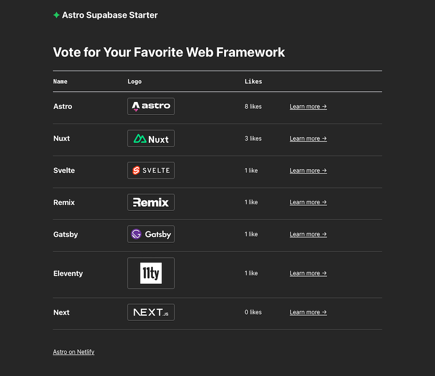

# Astro Supabase Starter



**View demo:** [https://astro-supabase-starter.netlify.app/](https://astro-supabase-starter.netlify.app/)

The Astro Supabase starter demonstrates how to integrate **Supabase** into an Astro project deployed on Netlify.

## Deploying to Netlify

If you click "Deploy to Netlify" button, it will create a new repo for you that looks exactly like this one, and sets that repo up immediately for deployment on Netlify.

[](https://app.netlify.com/start/deploy?repository=https://github.com/netlify-templates/astro-supabase-starter&fullConfiguration=true)

## Astro Commands

All commands are run from the root of the project, from a terminal:

| Command                   | Action                                           |
| :------------------------ | :----------------------------------------------- |
| `npm install`             | Installs dependencies                            |
| `npm run dev`             | Starts local dev server at `localhost:4321`      |
| `npm run build`           | Build your production site to `./dist/`          |
| `npm run preview`         | Preview your build locally, before deploying     |
| `npm run astro ...`       | Run CLI commands like `astro add`, `astro check` |
| `npm run astro -- --help` | Get help using the Astro CLI                     |

## Developing Locally

| Prerequisites                                                                |
| :--------------------------------------------------------------------------- |
| [Node.js](https://nodejs.org/) v18.14+                                       |
| (optional) [nvm](https://github.com/nvm-sh/nvm) for Node version management  |
| [Netlify account](https://netlify.com/)                                      |
| [Netlify CLI](https://docs.netlify.com/cli/get-started/).                    |
| [Supabase account](https://supabase.com/)                                    |

### Set up the database

To use this template, you’ll need to set up and seed a new Supabase database.

1. Create a new Supabase project.
2. Run the SQL commands found in the `supabase/migrations` directory in the Supabase UI.
3. To seed the database with data, you can import the contents of the `supabase/seed.csv` file in the Supabase UI.

ℹ️ _Note: This template was created to be used with the Supabase extension for Netlify. If you don’t wish to use the Netlify Supabase extension, you will need to set the `SUPABASE_DATABASE_URL` and `SUPABASE_ANON_KEY` environment variables in the `.env` file._

### Install and run locally

1. Clone this repository, then run `npm install` in its root directory.

2. For the starter to have full functionality locally, please ensure you have an up-to-date version of Netlify CLI. Run:

```
npm install netlify-cli@latest -g
```

3. Link your local repository to the deployed Netlify site. This will ensure you're using the same runtime version for both local development and your deployed site.

```
netlify link
```

4. Then, run the Astro.js development server via Netlify CLI:

```
netlify dev --target-port 4321
```

If your browser doesn't navigate to the site automatically, visit [localhost:8888](http://localhost:8888).

## Support

If you get stuck along the way, get help in our [support forums](https://answers.netlify.com/).
